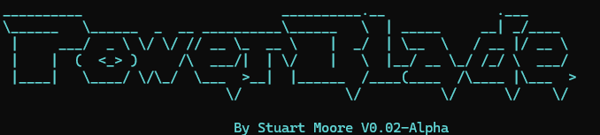

# PowerBlade V0.02-alpha

A SwitchBlade application that runs on PowerShell. More to be added as time goes on. Used as a teaching tool. Many more features to come!

Current features: 
1. View Services (Power-Service) #Classroom Example
2. View Processes (Power-Process) #Classroom Example
3. Empty Recycle Bin (Power-Bin) #Classroom Example
4. Installs modules for use outside of the main script (Required currently) 

In Progress

1. Hyper-V Module (Install Hyper-V, Create VMs etc)
2. Install Applications (Tidy winget)
3. Display Processes (Display all, individual, start and end processes)

Future Ideas

1. Remove modular requirement and run as single script
2. ???